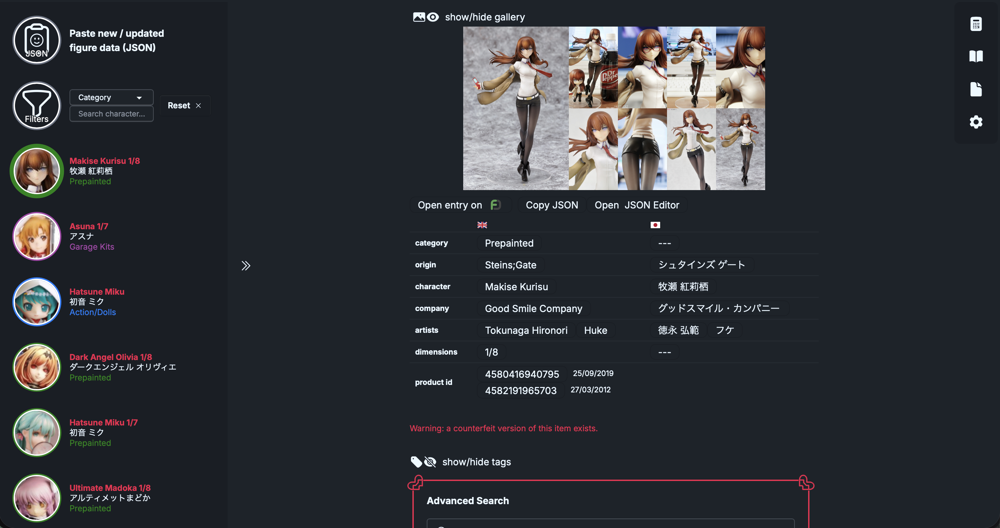

# Basic setup:
0. Find a way to install this extension to your browser (its unsigned, builds signed for different browsers will follow)
1. On an item entry on myfigurecollection.com, press the "Copy JSON" button that was added by the extension. You now have the stringified JSON object in in your clipboard.
2. Click the extension icon (might need to pin the extension to your toolbar so it shows up), and click the top left button to paste the data.
3. Rinse and repeat 1. and 2. for all figures/items you want to have in your dasboard. Switch between them by clicking on them on the left.
4. You can delete entries by right clicking on them in the left panel, and clicking delete in the menu that shows up.

# Advanced Search:
Just select the figure you want to search, click the text you want to add to your search bar, and then click on the search button you want (Google, Mercari, Suruga-ya, Yahoo Auctions Japan (Buyee), custom button)
The custom button can, as the name suggests, be customized. Just click the pencil symbol to show the editing fields.

# Dictionary:

In the top right menu, click the book to open the dictionary. Here you can click on some commonly used words to add to your searchbar. You can also add entries here.

# Total Cost Calculator:
In the top right menu, select the calculator. Here you add the cost of the figure, shipping etc. and adjust vat/import tax as you like, to get an estimate of what your going to end up paying in total. (obviously only an estimate)

# Notes:
Click on the Document symbol in the top right menu to open the currently selected figures personal notes. You can write whatever you want here, for example links and prices you found for that figure.

# Settings:
Here you can delete all figure data and settings from your browsers database (Proceed with caution, this cannot be undone.),
You can also toggle nsfw figure visibility. This just hides figures from the selection, which happen to include the tags 18+, nsfw or nsfw+.
Finally, you can also export or import figure data here. The export copies all your figures data into your clipboard. The import recieves that data and feeds it into your database.

# Compatibility:

Works for all browsers, if you figure out how (will add browser specific builds in the future).
